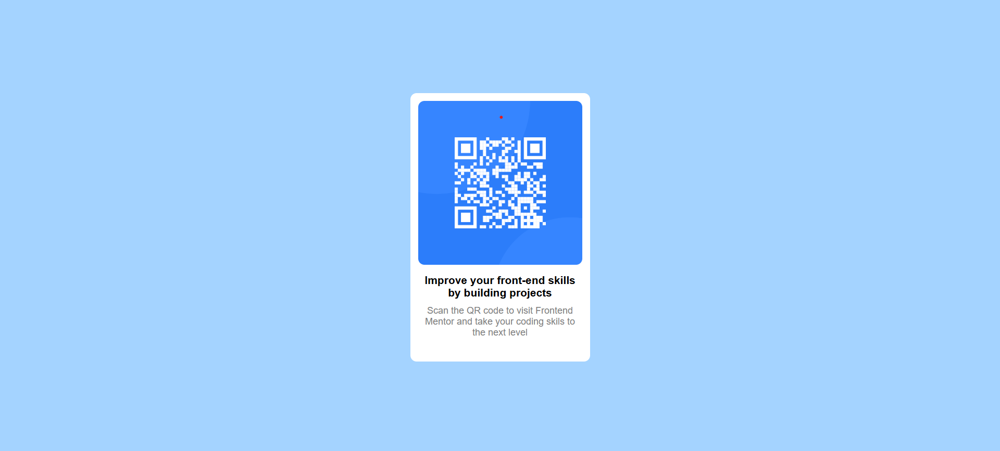

# Frontend Mentor - QR code component solution

This is a solution to the [QR code component challenge on Frontend Mentor](https://www.frontendmentor.io/challenges/qr-code-component-iux_sIO_H). Frontend Mentor challenges help you improve your coding skills by building realistic projects. 

## Table of contents

- [Overview](#overview)
  - [Screenshot](#screenshot)
  - [Links](#links)
- [My process](#my-process)
  - [Built with](#built-with)
  - [What I learned](#what-i-learned)
  - [Continued development](#continued-development)
- [Author](#author)

## Overview

I built a simple landing page that displayed a simple QR code card centered on the screen. this website is responsive and adjusts with different screen size.

### Screenshot

### Links

- Solution URL: [Add solution URL here] (https://github.com/Zimanie/project-ndex/tree/main/qr-code-component)
- Live Site URL: [Add live site URL here] (https://zimanie.github.io/qr-code-component/)

## My process

### Built with

- Semantic HTML5 markup
- CSS custom properties
- Flexbox
- Mobile-first workflow

### What I learned

I finally learned how to usw flexbox to center content both horizontally and vertically. and how to make images scale properly using width: 100%.

### Continued development

I want to improve how i structure my css and html properly

## Author
- Frontend Mentor - [@yourusername](https://www.frontendmentor.io/profile/Zimanie)
- Twitter - [@yourusername](https://www.twitter.com/Zimanie5)

